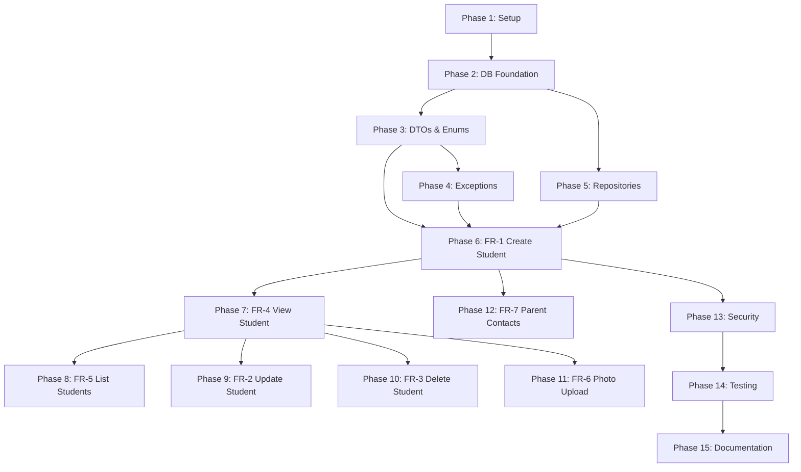

# Implementation Tasks: Student CRUD Operations

**Feature ID**: 003-student-crud
**Service**: student-service
**Total Tasks**: 92
**Estimated Complexity**: High

---

## Task Format

```
- [ ] [TaskID] [P?] [FR#] Description with file path
```

- **TaskID**: Unique identifier (T001-T092)
- **[P]**: Parallelizable (can run concurrently with adjacent tasks)
- **FR#**: Functional Requirement mapping (FR-1 through FR-7)
- **Description**: Clear action with affected file path

---

## Phase 1: Project Setup (T001-T012)

**Prerequisites**: Java 21, Maven 3.9+, Docker installed
**Estimated Time**: 2-3 hours
**Dependencies**: None (can start immediately)

### Tasks

- [X] [T001] [P] [Setup] Create student-service directory structure at `/student-service/src/main/java/com/sms/student/`
- [X] [T002] [P] [Setup] Create test directory structure at `/student-service/src/test/java/com/sms/student/`
- [X] [T003] [Setup] Create pom.xml with Spring Boot 3.5.7, PostgreSQL driver, Flyway, Lombok, Thumbnailator dependencies at `/student-service/pom.xml`
- [X] [T004] [P] [Setup] Create StudentServiceApplication.java main class at `/student-service/src/main/java/com/sms/student/StudentServiceApplication.java`
- [X] [T005] [P] [Setup] Create application.yml base configuration at `/student-service/src/main/resources/application.yml`
- [X] [T006] [P] [Setup] Create application-dev.yml development profile at `/student-service/src/main/resources/application-dev.yml`
- [X] [T007] [P] [Setup] Create application-prod.yml production profile at `/student-service/src/main/resources/application-prod.yml`
- [X] [T008] [Setup] Add student-service configuration to docker-compose.yml at `/docker-compose.yml`
- [X] [T009] [P] [Setup] Create Dockerfile for student-service at `/student-service/Dockerfile`
- [X] [T010] [P] [Setup] Create .env template for database credentials at `/student-service/.env.example`
- [X] [T011] [Setup] Create uploads/students directory for photo storage at `/uploads/students/`
- [X] [T012] [Setup] Verify Maven build: `mvn clean compile` from student-service directory

**Completion Criteria**: Service compiles successfully, Docker image builds

---

## Phase 2: Database Foundation (T013-T022)

**Prerequisites**: Phase 1 complete, PostgreSQL container running
**Estimated Time**: 3-4 hours
**Dependencies**: T001-T012

### Tasks

- [X] [T013] [P] [DB] Create Flyway migration V1__create_students_table.sql at `/student-service/src/main/resources/db/migration/V1__create_students_table.sql`
- [X] [T014] [P] [DB] Create Flyway migration V2__create_parent_contacts_table.sql at `/student-service/src/main/resources/db/migration/V2__create_parent_contacts_table.sql`
- [X] [T015] [P] [DB] Create Flyway migration V3__create_enrollments_table.sql at `/student-service/src/main/resources/db/migration/V3__create_enrollments_table.sql`
- [X] [T016] [DB] Create Flyway migration V4__create_views_and_functions.sql at `/student-service/src/main/resources/db/migration/V4__create_views_and_functions.sql`
- [X] [T017] [P] [DB] Create Student entity with JPA annotations at `/student-service/src/main/java/com/sms/student/entity/Student.java`
- [X] [T018] [P] [DB] Create ParentContact entity with JPA annotations at `/student-service/src/main/java/com/sms/student/entity/ParentContact.java`
- [X] [T019] [P] [DB] Create StudentClassEnrollment entity at `/student-service/src/main/java/com/sms/student/entity/StudentClassEnrollment.java`
- [X] [T020] [P] [DB] Create School reference entity (read-only) at `/student-service/src/main/java/com/sms/student/entity/School.java`
- [X] [T021] [P] [DB] Create Class entity with optimistic locking at `/student-service/src/main/java/com/sms/student/entity/SchoolClass.java`
- [X] [T022] [DB] Run Flyway migrations and verify schema: `mvn flyway:migrate`

**Completion Criteria**: All migrations applied, entities mapped correctly

---

## Phase 3: Core Enums & DTOs (T023-T035)

**Prerequisites**: Phase 2 complete
**Estimated Time**: 2-3 hours
**Dependencies**: T013-T022

### Tasks

- [X] [T023] [P] [Core] Create StudentStatus enum (ACTIVE, INACTIVE) at `/student-service/src/main/java/com/sms/student/enums/StudentStatus.java`
- [X] [T024] [P] [Core] Create Gender enum (M, F) at `/student-service/src/main/java/com/sms/student/enums/Gender.java`
- [X] [T025] [P] [Core] Create Relationship enum (MOTHER, FATHER, GUARDIAN, OTHER) at `/student-service/src/main/java/com/sms/student/enums/Relationship.java`
- [X] [T026] [P] [Core] Create DeletionReason enum (GRADUATED, TRANSFERRED, WITHDREW, OTHER) at `/student-service/src/main/java/com/sms/student/enums/DeletionReason.java`
- [X] [T027] [P] [Core] Create ErrorCode enum with 13 codes at `/student-service/src/main/java/com/sms/student/dto/ErrorCode.java`
- [X] [T028] [P] [Core] Create ApiResponse<T> wrapper class at `/student-service/src/main/java/com/sms/student/dto/ApiResponse.java`
- [X] [T029] [P] [Core] Create StudentRequest DTO at `/student-service/src/main/java/com/sms/student/dto/StudentRequest.java`
- [X] [T030] [P] [Core] Create StudentResponse DTO at `/student-service/src/main/java/com/sms/student/dto/StudentResponse.java`
- [X] [T031] [P] [Core] Create StudentSummary DTO at `/student-service/src/main/java/com/sms/student/dto/StudentSummary.java`
- [X] [T032] [P] [Core] Create ParentContactRequest DTO at `/student-service/src/main/java/com/sms/student/dto/ParentContactRequest.java`
- [X] [T033] [P] [Core] Create ParentContactResponse DTO at `/student-service/src/main/java/com/sms/student/dto/ParentContactResponse.java`
- [X] [T034] [P] [Core] Create PhotoUploadResponse DTO at `/student-service/src/main/java/com/sms/student/dto/PhotoUploadResponse.java`
- [X] [T035] [P] [Core] Create StudentListResponse DTO with pagination at `/student-service/src/main/java/com/sms/student/dto/StudentListResponse.java`

**Completion Criteria**: All DTOs compile with validation annotations

---

## Phase 4: Exception Handling (T036-T042)

**Prerequisites**: Phase 3 complete
**Estimated Time**: 1-2 hours
**Dependencies**: T027

### Tasks

- [X] [T036] [P] [Core] Create StudentNotFoundException at `/student-service/src/main/java/com/sms/student/exception/StudentNotFoundException.java`
- [X] [T037] [P] [Core] Create InvalidStudentDataException at `/student-service/src/main/java/com/sms/student/exception/InvalidStudentDataException.java`
- [X] [T038] [P] [Core] Create DuplicateStudentCodeException at `/student-service/src/main/java/com/sms/student/exception/DuplicateStudentCodeException.java`
- [X] [T039] [P] [Core] Create PhotoSizeExceededException at `/student-service/src/main/java/com/sms/student/exception/PhotoSizeExceededException.java`
- [X] [T040] [P] [Core] Create InvalidPhotoFormatException at `/student-service/src/main/java/com/sms/student/exception/InvalidPhotoFormatException.java`
- [X] [T041] [P] [Core] Create ClassNotFoundException at `/student-service/src/main/java/com/sms/student/exception/ClassNotFoundException.java`
- [X] [T042] [Core] Create GlobalExceptionHandler with @ControllerAdvice at `/student-service/src/main/java/com/sms/student/exception/GlobalExceptionHandler.java`

**Completion Criteria**: All exceptions map to ApiResponse with correct ErrorCode

---

## Phase 5: Repository Layer (T043-T048)

**Prerequisites**: Phase 2 complete
**Estimated Time**: 1-2 hours
**Dependencies**: T017-T021

### Tasks

- [ ] [T043] [P] [FR-1,4,5] Create StudentRepository with custom queries at `/student-service/src/main/java/com/sms/student/repository/StudentRepository.java`
- [ ] [T044] [P] [FR-7] Create ParentContactRepository at `/student-service/src/main/java/com/sms/student/repository/ParentContactRepository.java`
- [ ] [T045] [P] [FR-1] Create StudentClassEnrollmentRepository at `/student-service/src/main/java/com/sms/student/repository/StudentClassEnrollmentRepository.java`
- [ ] [T046] [P] [FR-1] Create SchoolRepository (read-only) at `/student-service/src/main/java/com/sms/student/repository/SchoolRepository.java`
- [ ] [T047] [P] [FR-1] Create ClassRepository with optimistic locking at `/student-service/src/main/java/com/sms/student/repository/ClassRepository.java`
- [ ] [T048] [Core] Add custom query methods: findByClassIdAndStatus, findActiveStudents, existsByStudentCode

**Completion Criteria**: All repositories extend JpaRepository with correct types

---

## Phase 6: FR-1 Create Student Profile (T049-T062)

**Priority**: P1 (MVP Critical)
**Prerequisites**: Phase 3, 4, 5 complete
**Estimated Time**: 4-5 hours
**Dependencies**: T023-T048

### Tasks

- [ ] [T049] [FR-1] Create StudentService interface at `/student-service/src/main/java/com/sms/student/service/StudentService.java`
- [ ] [T050] [FR-1] Implement StudentServiceImpl with createStudent() method at `/student-service/src/main/java/com/sms/student/service/impl/StudentServiceImpl.java`
- [ ] [T051] [FR-1] Add student code generation logic (format: STU-YYYY-NNNN) in StudentServiceImpl
- [ ] [T052] [FR-1] Add duplicate student code validation in createStudent()
- [ ] [T053] [FR-1] Add class validation (check classId exists and is not full) in createStudent()
- [ ] [T054] [FR-1] Implement parent contact creation with primary contact validation
- [ ] [T055] [FR-1] Create StudentClassEnrollment record on student creation
- [ ] [T056] [FR-1] Add transaction management with @Transactional annotation
- [ ] [T057] [FR-1] Create StudentController with POST /api/students endpoint at `/student-service/src/main/java/com/sms/student/controller/StudentController.java`
- [ ] [T058] [FR-1] Add request validation with @Valid annotation in controller
- [ ] [T059] [FR-1] Implement DTO to entity mapping in StudentService
- [ ] [T060] [FR-1] Implement entity to DTO mapping in StudentService
- [ ] [T061] [FR-1] Add unit tests for StudentService.createStudent() at `/student-service/src/test/java/com/sms/student/service/StudentServiceTest.java`
- [ ] [T062] [FR-1] Add integration test for POST /api/students at `/student-service/src/test/java/com/sms/student/controller/StudentControllerTest.java`

**Completion Criteria**: Can create student with parent contacts via API, tests pass

---

## Phase 7: FR-4 View Student Details (T063-T068)

**Priority**: P2
**Prerequisites**: Phase 6 complete
**Estimated Time**: 2-3 hours
**Dependencies**: T049-T062

### Tasks

- [ ] [T063] [P] [FR-4] Add getStudentById() method to StudentService interface
- [ ] [T064] [FR-4] Implement getStudentById() in StudentServiceImpl with eager loading of parent contacts
- [ ] [T065] [FR-4] Add age calculation logic in StudentResponse DTO
- [ ] [T066] [FR-4] Add GET /api/students/{id} endpoint to StudentController
- [ ] [T067] [FR-4] Add unit tests for StudentService.getStudentById()
- [ ] [T068] [FR-4] Add integration test for GET /api/students/{id} with 404 case

**Completion Criteria**: Can retrieve student by ID with parent contacts, age calculated

---

## Phase 8: FR-5 List Students by Class (T069-T077)

**Priority**: P2
**Prerequisites**: Phase 7 complete
**Estimated Time**: 3-4 hours
**Dependencies**: T063-T068

### Tasks

- [ ] [T069] [FR-5] Add listStudents() method with pagination to StudentService interface
- [ ] [T070] [FR-5] Implement listStudents() with Pageable parameter in StudentServiceImpl
- [ ] [T071] [FR-5] Add classId filtering logic using StudentRepository custom query
- [ ] [T072] [FR-5] Add status filtering logic (default ACTIVE)
- [ ] [T073] [FR-5] Implement StudentSummary DTO mapping with primary parent contact
- [ ] [T074] [FR-5] Add GET /api/students endpoint with query parameters to StudentController
- [ ] [T075] [FR-5] Add GET /api/students/class/{classId} convenience endpoint
- [ ] [T076] [FR-5] Add unit tests for StudentService.listStudents() with various filters
- [ ] [T077] [FR-5] Add integration test for pagination and filtering

**Completion Criteria**: Can list students with pagination, filtering by class and status

---

## Phase 9: FR-2 Update Student Information (T078-T086)

**Priority**: P3
**Prerequisites**: Phase 7 complete
**Estimated Time**: 3-4 hours
**Dependencies**: T063-T068

### Tasks

- [ ] [T078] [FR-2] Add updateStudent() method to StudentService interface
- [ ] [T079] [FR-2] Implement updateStudent() in StudentServiceImpl with fetch-then-update pattern
- [ ] [T080] [FR-2] Add validation: cannot change student code
- [ ] [T081] [FR-2] Add validation: cannot change enrollment date
- [ ] [T082] [FR-2] Implement parent contact update logic (delete removed, add new, update existing)
- [ ] [T083] [FR-2] Add optimistic locking retry logic for concurrent updates
- [ ] [T084] [FR-2] Add PUT /api/students/{id} endpoint to StudentController
- [ ] [T085] [FR-2] Add unit tests for StudentService.updateStudent() with validation cases
- [ ] [T086] [FR-2] Add integration test for PUT /api/students/{id} with conflict scenarios

**Completion Criteria**: Can update student info, parent contacts handled correctly

---

## Phase 10: FR-3 Soft Delete Student (T087-T092)

**Priority**: P3
**Prerequisites**: Phase 7 complete
**Estimated Time**: 2-3 hours
**Dependencies**: T063-T068

### Tasks

- [ ] [T087] [FR-3] Add deleteStudent() method with reason parameter to StudentService interface
- [ ] [T088] [FR-3] Implement soft delete logic: set status=INACTIVE, deleted_at=now()
- [ ] [T089] [FR-3] Add cascade soft delete for parent contacts (set is_active=false)
- [ ] [T090] [FR-3] Add DELETE /api/students/{id}?reason=GRADUATED endpoint to StudentController
- [ ] [T091] [FR-3] Add unit tests for StudentService.deleteStudent() with all deletion reasons
- [ ] [T092] [FR-3] Add integration test for DELETE /api/students/{id} with validation

**Completion Criteria**: Can soft delete student, record remains in database with status=INACTIVE

---

## Phase 11: FR-6 Student Photo Upload (T093-T103)

**Priority**: P4
**Prerequisites**: Phase 7 complete
**Estimated Time**: 4-5 hours
**Dependencies**: T063-T068

### Tasks

- [ ] [T093] [P] [FR-6] Create PhotoStorageService interface at `/student-service/src/main/java/com/sms/student/service/PhotoStorageService.java`
- [ ] [T094] [FR-6] Implement LocalPhotoStorageService at `/student-service/src/main/java/com/sms/student/service/impl/LocalPhotoStorageService.java`
- [ ] [T095] [FR-6] Add file validation: check MIME type (image/jpeg, image/png)
- [ ] [T096] [FR-6] Add file size validation: max 5MB
- [ ] [T097] [FR-6] Implement filename generation: {studentId}_{timestamp}.jpg
- [ ] [T098] [FR-6] Add Thumbnailator integration for image resize (400x400 standard, 100x100 thumbnail)
- [ ] [T099] [FR-6] Implement photo save logic with duplicate handling (delete old photo)
- [ ] [T100] [FR-6] Add uploadPhoto() method to StudentService interface
- [ ] [T101] [FR-6] Add POST /api/students/{id}/photo endpoint to StudentController
- [ ] [T102] [FR-6] Add unit tests for PhotoStorageService with mock files
- [ ] [T103] [FR-6] Add integration test for POST /api/students/{id}/photo with 5MB+ file

**Completion Criteria**: Can upload photo, old photo deleted, image resized correctly

---

## Phase 12: FR-7 Parent Contact Management (T104-T111)

**Priority**: P5
**Prerequisites**: Phase 6 complete
**Estimated Time**: 3-4 hours
**Dependencies**: T049-T062

### Tasks

- [ ] [T104] [P] [FR-7] Create ParentContactService interface at `/student-service/src/main/java/com/sms/student/service/ParentContactService.java`
- [ ] [T105] [FR-7] Implement ParentContactServiceImpl at `/student-service/src/main/java/com/sms/student/service/impl/ParentContactServiceImpl.java`
- [ ] [T106] [FR-7] Add validation: only one primary contact per student
- [ ] [T107] [FR-7] Add phone number validation: Cambodia format (+855XXXXXXXX)
- [ ] [T108] [FR-7] Add addParentContact() method to StudentService
- [ ] [T109] [FR-7] Add updateParentContact() method to StudentService
- [ ] [T110] [FR-7] Add unit tests for ParentContactService with validation cases
- [ ] [T111] [FR-7] Add integration test for parent contact CRUD operations

**Completion Criteria**: Can manage parent contacts independently, validation works

---

## Phase 13: Security & Configuration (T112-T120)

**Prerequisites**: Phase 6 complete
**Estimated Time**: 3-4 hours
**Dependencies**: T049-T062

### Tasks

- [ ] [T112] [P] [Security] Create JwtAuthenticationFilter at `/student-service/src/main/java/com/sms/student/config/JwtAuthenticationFilter.java`
- [ ] [T113] [P] [Security] Create SecurityConfig with JWT validation at `/student-service/src/main/java/com/sms/student/config/SecurityConfig.java`
- [ ] [T114] [Security] Add role-based access control: TEACHER role required for all endpoints
- [ ] [T115] [P] [Config] Create OpenAPI configuration class at `/student-service/src/main/java/com/sms/student/config/OpenApiConfig.java`
- [ ] [T116] [P] [Config] Add Swagger UI customization with JWT auth button
- [ ] [T117] [P] [Config] Create EurekaConfig for service discovery at `/student-service/src/main/java/com/sms/student/config/EurekaConfig.java`
- [ ] [T118] [Config] Add actuator endpoints configuration in application.yml
- [ ] [T119] [P] [Config] Create FileUploadConfig for photo storage at `/student-service/src/main/java/com/sms/student/config/FileUploadConfig.java`
- [ ] [T120] [Security] Add integration test for JWT authentication on protected endpoints

**Completion Criteria**: All endpoints require JWT, Swagger UI functional, Eureka registered

---

## Phase 14: Testing & Quality (T121-T132)

**Prerequisites**: All functional phases complete
**Estimated Time**: 5-6 hours
**Dependencies**: T049-T120

### Tasks

- [ ] [T121] [P] [Test] Create TestDataFactory utility at `/student-service/src/test/java/com/sms/student/util/TestDataFactory.java`
- [ ] [T122] [P] [Test] Create StudentRepositoryTest with Testcontainers at `/student-service/src/test/java/com/sms/student/repository/StudentRepositoryTest.java`
- [ ] [T123] [P] [Test] Create ParentContactRepositoryTest at `/student-service/src/test/java/com/sms/student/repository/ParentContactRepositoryTest.java`
- [ ] [T124] [Test] Add edge case tests: student with no parent contacts (should fail)
- [ ] [T125] [Test] Add edge case tests: student with 5+ parent contacts
- [ ] [T126] [Test] Add edge case tests: duplicate student code handling
- [ ] [T127] [Test] Add edge case tests: concurrent enrollment in same class
- [ ] [T128] [Test] Add performance test: bulk student creation (100 students)
- [ ] [T129] [Test] Add performance test: pagination with 10,000 students
- [ ] [T130] [Test] Run test coverage report: `mvn test jacoco:report`
- [ ] [T131] [Test] Verify test coverage >80% for service layer
- [ ] [T132] [Test] Run integration tests with `mvn verify`

**Completion Criteria**: All tests pass, coverage >80%, performance goals met

---

## Phase 15: Documentation & Deployment (T133-T142)

**Prerequisites**: All previous phases complete
**Estimated Time**: 2-3 hours
**Dependencies**: T001-T132

### Tasks

- [ ] [T133] [P] [Docs] Generate OpenAPI spec JSON: `curl http://localhost:8082/v3/api-docs > student-api-spec.json`
- [ ] [T134] [P] [Docs] Update README.md with API documentation at `/student-service/README.md`
- [ ] [T135] [P] [Docs] Create API usage examples in docs/ directory
- [ ] [T136] [Deploy] Build Docker image: `docker-compose build student-service`
- [ ] [T137] [Deploy] Start full stack: `docker-compose up -d`
- [ ] [T138] [Deploy] Verify service health: `curl http://localhost:8082/actuator/health`
- [ ] [T139] [Deploy] Verify Eureka registration: `curl http://localhost:8761`
- [ ] [T140] [Deploy] Test end-to-end flow: create student, upload photo, retrieve details
- [ ] [T141] [Deploy] Run smoke tests against deployed service
- [ ] [T142] [Deploy] Generate deployment checklist for production

**Completion Criteria**: Service deployed, all health checks pass, E2E flow works

---

## Dependency Graph



---

## Parallel Execution Opportunities

### Group 1: Setup (Can run in parallel after prerequisites installed)
- T001-T002, T004-T007, T009-T011 (Directory and config file creation)

### Group 2: Database Migrations (Can run in parallel)
- T013-T015 (Independent table creation scripts)
- T017-T021 (Entity class creation)

### Group 3: DTOs (Can run in parallel)
- T023-T026 (Enum creation)
- T029-T035 (DTO class creation)

### Group 4: Exceptions (Can run in parallel)
- T036-T041 (Exception class creation)

### Group 5: Repositories (Can run in parallel)
- T043-T047 (Repository interface creation)

### Group 6: Services (After Phase 6 complete)
- Phase 8 (FR-5 List) and Phase 9 (FR-2 Update) can run in parallel
- Phase 10 (FR-3 Delete) and Phase 11 (FR-6 Photo) can run in parallel

### Group 7: Configuration (Can run in parallel)
- T112, T115, T117, T119 (Config class creation)

### Group 8: Testing (Can run in parallel)
- T121-T123 (Test class creation)
- T124-T129 (Edge case test writing)

---

## MVP Scope Recommendation

**Minimum Viable Product** (for initial deployment):
- **Phase 1-6**: Setup through FR-1 (Create Student)
- **Phase 7**: FR-4 (View Student Details)
- **Phase 13**: Security (JWT authentication)

**Total MVP Tasks**: 62 tasks (T001-T062)
**Estimated MVP Time**: 18-22 hours

**Deferred for v1.1**:
- FR-5 (List Students) - Can manually query database initially
- FR-2 (Update Student) - Can delete and recreate for corrections
- FR-3 (Soft Delete) - Can manually update database
- FR-6 (Photo Upload) - Can add photos later via admin panel
- FR-7 (Parent Contact Management) - Included in FR-1, separate CRUD not critical

---

## Task Summary

| Phase | Task Range | Count | Priority | Estimated Hours |
|-------|-----------|-------|----------|-----------------|
| 1. Setup | T001-T012 | 12 | Critical | 2-3 |
| 2. DB Foundation | T013-T022 | 10 | Critical | 3-4 |
| 3. DTOs & Enums | T023-T035 | 13 | Critical | 2-3 |
| 4. Exceptions | T036-T042 | 7 | Critical | 1-2 |
| 5. Repositories | T043-T048 | 6 | Critical | 1-2 |
| 6. FR-1 Create | T049-T062 | 14 | P1 (MVP) | 4-5 |
| 7. FR-4 View | T063-T068 | 6 | P2 | 2-3 |
| 8. FR-5 List | T069-T077 | 9 | P2 | 3-4 |
| 9. FR-2 Update | T078-T086 | 9 | P3 | 3-4 |
| 10. FR-3 Delete | T087-T092 | 6 | P3 | 2-3 |
| 11. FR-6 Photo | T093-T103 | 11 | P4 | 4-5 |
| 12. FR-7 Parent | T104-T111 | 8 | P5 | 3-4 |
| 13. Security | T112-T120 | 9 | Critical | 3-4 |
| 14. Testing | T121-T132 | 12 | Critical | 5-6 |
| 15. Docs & Deploy | T133-T142 | 10 | Critical | 2-3 |
| **TOTAL** | **T001-T142** | **142** | - | **42-55** |

---

## Constitution Compliance Notes

- **Gate 1 (Microservices-First)**: ✅ Independent student-service with own database
- **Gate 2 (Security-First)**: ✅ JWT authentication on all endpoints (Phase 13)
- **Gate 3 (Simplicity)**: ✅ Local filesystem storage (not premature S3), synchronous photo processing
- **Gate 4 (Observability)**: ✅ Actuator health checks, audit fields on entities
- **Gate 5 (Test Discipline)**: ✅ Unit and integration tests for all service methods (Phase 14)
- **Gate 6 (API Conventions)**: ✅ ApiResponse wrapper with errorCode + data format

---

## Critical Path

The shortest path to a working system:

1. **Week 1**: T001-T048 (Setup, DB, Core Components) - 10-14 hours
2. **Week 2**: T049-T062, T063-T068 (Create + View Student) - 6-8 hours
3. **Week 3**: T112-T120 (Security), T121-T132 (Testing) - 8-10 hours
4. **Week 4**: T133-T142 (Deployment) - 2-3 hours

**Total Critical Path**: 26-35 hours over 4 weeks

---

## Notes

- All tasks marked [P] can be parallelized with adjacent tasks in the same phase
- Task IDs are sequential but execution order should follow dependency graph
- Performance goals: <3s creation, <5s updates, <15s photo uploads (tested in T128-T129)
- Database indexes (created in V1-V4 migrations) support 10,000+ students
- Photo storage directory must be writable by application user (checked in T011)
- JWT secret must be configured in application.yml before Phase 13
- Testcontainers requires Docker running locally for Phase 14

---

**Status**: ✅ Task List Complete
**Ready for**: `/speckit.implement` command to begin implementation
