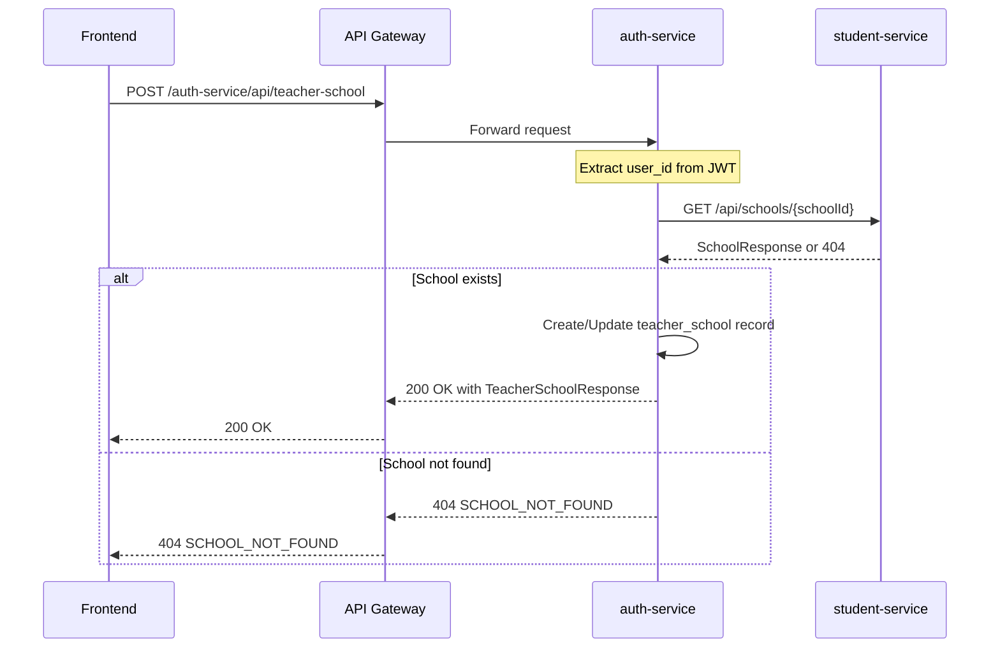

# API Endpoints: Teacher School Setup

**Feature**: 009-teacher-school-setup
**Date**: 2025-12-10
**Version**: 1.0.0

## Overview

This document defines the REST API endpoints for the teacher school setup feature. Endpoints are split across two microservices following the SMS architecture:

- **student-service**: Location data (provinces, districts, schools)
- **auth-service**: Teacher-school associations

All endpoints follow the SMS API conventions:
- Return `ApiResponse<T>` wrapper with `errorCode` and `data`
- Require JWT authentication (except health checks)
- Use standard HTTP status codes
- Support English/Khmer error messages via frontend i18n

---

## student-service Endpoints

Base URL: `http://localhost:8080/student-service` (via API Gateway)

### 1. GET /api/provinces

**Purpose**: Retrieve list of all provinces for dropdown selection.

**Authentication**: Required (JWT token)

**Request**:
```http
GET /api/provinces HTTP/1.1
Host: localhost:8080
Authorization: Bearer <jwt_token>
```

**Response** (200 OK):
```json
{
  "errorCode": "SUCCESS",
  "data": [
    {
      "id": "f47ac10b-58cc-4372-a567-0e02b2c3d479",
      "name": "Phnom Penh",
      "nameKhmer": "ភ្នំពេញ",
      "code": "PP"
    },
    {
      "id": "c9f0f895-fb98-42e7-9e4b-3a4b5c6d7e8f",
      "name": "Siem Reap",
      "nameKhmer": "សៀមរាប",
      "code": "SR"
    }
  ]
}
```

**Error Responses**:

401 Unauthorized:
```json
{
  "errorCode": "UNAUTHORIZED",
  "data": null
}
```

500 Internal Server Error:
```json
{
  "errorCode": "INTERNAL_ERROR",
  "data": null
}
```

**Notes**:
- No pagination (total ~25 provinces in Cambodia)
- Results ordered alphabetically by name
- Cached by frontend TanStack Query (5-minute default)

---

### 2. GET /api/districts

**Purpose**: Retrieve districts for a specific province.

**Authentication**: Required (JWT token)

**Query Parameters**:
- `provinceId` (required, UUID): ID of the province

**Request**:
```http
GET /api/districts?provinceId=f47ac10b-58cc-4372-a567-0e02b2c3d479 HTTP/1.1
Host: localhost:8080
Authorization: Bearer <jwt_token>
```

**Response** (200 OK):
```json
{
  "errorCode": "SUCCESS",
  "data": [
    {
      "id": "a1b2c3d4-e5f6-4a5b-8c9d-0e1f2a3b4c5d",
      "provinceId": "f47ac10b-58cc-4372-a567-0e02b2c3d479",
      "name": "Chamkar Mon",
      "nameKhmer": "ចំការមន",
      "code": "CM"
    },
    {
      "id": "b2c3d4e5-f6a7-4b5c-9d0e-1f2a3b4c5d6e",
      "provinceId": "f47ac10b-58cc-4372-a567-0e02b2c3d479",
      "name": "Doun Penh",
      "nameKhmer": "ដូនពេញ",
      "code": "DP"
    }
  ]
}
```

**Error Responses**:

400 Bad Request (missing provinceId):
```json
{
  "errorCode": "INVALID_INPUT",
  "data": null
}
```

404 Not Found (province doesn't exist):
```json
{
  "errorCode": "PROVINCE_NOT_FOUND",
  "data": null
}
```

401 Unauthorized:
```json
{
  "errorCode": "UNAUTHORIZED",
  "data": null
}
```

**Notes**:
- No pagination (typically 5-15 districts per province)
- Results ordered alphabetically by name
- Empty array returned if province has no districts

---

### 3. GET /api/schools

**Purpose**: Retrieve schools for a specific district.

**Authentication**: Required (JWT token)

**Query Parameters**:
- `districtId` (required, UUID): ID of the district

**Request**:
```http
GET /api/schools?districtId=a1b2c3d4-e5f6-4a5b-8c9d-0e1f2a3b4c5d HTTP/1.1
Host: localhost:8080
Authorization: Bearer <jwt_token>
```

**Response** (200 OK):
```json
{
  "errorCode": "SUCCESS",
  "data": [
    {
      "id": "d4e5f6a7-b8c9-4d0e-1f2a-3b4c5d6e7f8a",
      "name": "Preah Sisowath High School",
      "nameKhmer": "វិទ្យាល័យព្រះស៊ីសុវត្ថិ",
      "address": "Street 240, Sangkat Chey Chomneas",
      "provinceId": "f47ac10b-58cc-4372-a567-0e02b2c3d479",
      "districtId": "a1b2c3d4-e5f6-4a5b-8c9d-0e1f2a3b4c5d",
      "provinceName": "Phnom Penh",
      "districtName": "Chamkar Mon",
      "type": "HIGH_SCHOOL",
      "createdAt": "2024-01-15T08:30:00Z",
      "updatedAt": "2024-01-15T08:30:00Z"
    }
  ]
}
```

**Error Responses**:

400 Bad Request (missing districtId):
```json
{
  "errorCode": "INVALID_INPUT",
  "data": null
}
```

404 Not Found (district doesn't exist):
```json
{
  "errorCode": "DISTRICT_NOT_FOUND",
  "data": null
}
```

401 Unauthorized:
```json
{
  "errorCode": "UNAUTHORIZED",
  "data": null
}
```

**Notes**:
- No pagination initially (typically 10-50 schools per district)
- Results ordered alphabetically by name
- Empty array returned if district has no schools
- provinceName and districtName enriched via JOIN for display

---

### 4. POST /api/schools

**Purpose**: Create a new school under a specific province and district.

**Authentication**: Required (JWT token)

**Request**:
```http
POST /api/schools HTTP/1.1
Host: localhost:8080
Authorization: Bearer <jwt_token>
Content-Type: application/json

{
  "name": "Preah Ang Duong High School",
  "nameKhmer": "វិទ្យាល័យព្រះអង្គដួង",
  "address": "Street 19, Sangkat Stung Meanchey",
  "provinceId": "f47ac10b-58cc-4372-a567-0e02b2c3d479",
  "districtId": "b2c3d4e5-f6a7-4b5c-9d0e-1f2a3b4c5d6e",
  "type": "HIGH_SCHOOL"
}
```

**Response** (201 Created):
```json
{
  "errorCode": "SUCCESS",
  "data": {
    "id": "e5f6a7b8-c9d0-4e1f-2a3b-4c5d6e7f8a9b",
    "name": "Preah Ang Duong High School",
    "nameKhmer": "វិទ្យាល័យព្រះអង្គដួង",
    "address": "Street 19, Sangkat Stung Meanchey",
    "provinceId": "f47ac10b-58cc-4372-a567-0e02b2c3d479",
    "districtId": "b2c3d4e5-f6a7-4b5c-9d0e-1f2a3b4c5d6e",
    "provinceName": "Phnom Penh",
    "districtName": "Doun Penh",
    "type": "HIGH_SCHOOL",
    "createdAt": "2025-12-10T10:15:30Z",
    "updatedAt": "2025-12-10T10:15:30Z"
  }
}
```

**Error Responses**:

400 Bad Request (validation failure):
```json
{
  "errorCode": "INVALID_INPUT",
  "data": null
}
```

404 Not Found (province or district doesn't exist):
```json
{
  "errorCode": "PROVINCE_NOT_FOUND",
  "data": null
}
```
or
```json
{
  "errorCode": "DISTRICT_NOT_FOUND",
  "data": null
}
```

409 Conflict (duplicate school name in district):
```json
{
  "errorCode": "DUPLICATE_SCHOOL_NAME",
  "data": null
}
```

401 Unauthorized:
```json
{
  "errorCode": "UNAUTHORIZED",
  "data": null
}
```

**Validation Rules**:
- `name`: Required, max 255 characters
- `nameKhmer`: Optional, max 255 characters
- `address`: Required, max 500 characters
- `provinceId`: Required, valid UUID, must exist
- `districtId`: Required, valid UUID, must exist, must belong to specified province
- `type`: Required, one of: PRIMARY, SECONDARY, HIGH_SCHOOL, VOCATIONAL

**Notes**:
- No admin approval required (per spec simplicity)
- School immediately available for selection after creation
- User ID extracted from JWT for audit logging

---

## auth-service Endpoints

Base URL: `http://localhost:8080/auth-service` (via API Gateway)

### 5. POST /api/teacher-school

**Purpose**: Associate authenticated teacher with a school (create or update).

**Authentication**: Required (JWT token)

**Request**:
```http
POST /api/teacher-school HTTP/1.1
Host: localhost:8080
Authorization: Bearer <jwt_token>
Content-Type: application/json

{
  "schoolId": "d4e5f6a7-b8c9-4d0e-1f2a-3b4c5d6e7f8a",
  "principalName": "Mr. Sok Sambath",
  "principalGender": "M"
}
```

**Response** (200 OK for update, 201 Created for new):
```json
{
  "errorCode": "SUCCESS",
  "data": {
    "id": "f6a7b8c9-d0e1-4f2a-3b4c-5d6e7f8a9b0c",
    "userId": "a1b2c3d4-e5f6-4a5b-8c9d-0e1f2a3b4c5d",
    "schoolId": "d4e5f6a7-b8c9-4d0e-1f2a-3b4c5d6e7f8a",
    "schoolName": "Preah Sisowath High School",
    "principalName": "Mr. Sok Sambath",
    "principalGender": "M",
    "createdAt": "2025-12-10T10:20:00Z",
    "updatedAt": "2025-12-10T10:20:00Z"
  }
}
```

**Error Responses**:

400 Bad Request (validation failure):
```json
{
  "errorCode": "INVALID_INPUT",
  "data": null
}
```

400 Bad Request (invalid principal data):
```json
{
  "errorCode": "INVALID_PRINCIPAL_DATA",
  "data": null
}
```

404 Not Found (school doesn't exist in student-service):
```json
{
  "errorCode": "SCHOOL_NOT_FOUND",
  "data": null
}
```

401 Unauthorized:
```json
{
  "errorCode": "UNAUTHORIZED",
  "data": null
}
```

**Validation Rules**:
- `schoolId`: Required, valid UUID, must exist in student-service
- `principalName`: Required, max 255 characters
- `principalGender`: Required, must be 'M' or 'F'

**Notes**:
- User ID extracted from JWT token (not in request body)
- Implements UPSERT logic: creates if not exists, updates if exists (unique constraint on user_id)
- Cross-service validation: checks schoolId exists via HTTP call to student-service
- schoolName enriched from student-service for response

---

### 6. GET /api/teacher-school

**Purpose**: Retrieve authenticated teacher's current school association.

**Authentication**: Required (JWT token)

**Request**:
```http
GET /api/teacher-school HTTP/1.1
Host: localhost:8080
Authorization: Bearer <jwt_token>
```

**Response** (200 OK):
```json
{
  "errorCode": "SUCCESS",
  "data": {
    "id": "f6a7b8c9-d0e1-4f2a-3b4c-5d6e7f8a9b0c",
    "userId": "a1b2c3d4-e5f6-4a5b-8c9d-0e1f2a3b4c5d",
    "schoolId": "d4e5f6a7-b8c9-4d0e-1f2a-3b4c5d6e7f8a",
    "schoolName": "Preah Sisowath High School",
    "principalName": "Mr. Sok Sambath",
    "principalGender": "M",
    "createdAt": "2025-12-10T10:20:00Z",
    "updatedAt": "2025-12-10T10:20:00Z"
  }
}
```

**Response** (404 Not Found - no association exists):
```json
{
  "errorCode": "NOT_FOUND",
  "data": null
}
```

**Error Responses**:

401 Unauthorized:
```json
{
  "errorCode": "UNAUTHORIZED",
  "data": null
}
```

**Notes**:
- User ID extracted from JWT token
- 404 response indicates teacher hasn't completed school setup
- Frontend uses this to redirect to school setup page
- schoolName enriched from student-service

---

### 7. PUT /api/teacher-school

**Purpose**: Update authenticated teacher's school association (edge case: changing schools).

**Authentication**: Required (JWT token)

**Request**:
```http
PUT /api/teacher-school HTTP/1.1
Host: localhost:8080
Authorization: Bearer <jwt_token>
Content-Type: application/json

{
  "schoolId": "e5f6a7b8-c9d0-4e1f-2a3b-4c5d6e7f8a9b",
  "principalName": "Mrs. Chan Dara",
  "principalGender": "F"
}
```

**Response** (200 OK):
```json
{
  "errorCode": "SUCCESS",
  "data": {
    "id": "f6a7b8c9-d0e1-4f2a-3b4c-5d6e7f8a9b0c",
    "userId": "a1b2c3d4-e5f6-4a5b-8c9d-0e1f2a3b4c5d",
    "schoolId": "e5f6a7b8-c9d0-4e1f-2a3b-4c5d6e7f8a9b",
    "schoolName": "Preah Ang Duong High School",
    "principalName": "Mrs. Chan Dara",
    "principalGender": "F",
    "createdAt": "2025-12-10T10:20:00Z",
    "updatedAt": "2025-12-10T11:45:00Z"
  }
}
```

**Error Responses**: Same as POST /api/teacher-school

**Notes**:
- Functionally identical to POST (both use UPSERT logic)
- Provided for REST semantic clarity (PUT = update existing resource)
- Not used in initial school setup flow (only for future school transfers)

---

## Error Code Summary

### student-service Error Codes

| Error Code | HTTP Status | Description | Frontend Translation Key |
|------------|-------------|-------------|--------------------------|
| `SUCCESS` | 200/201 | Request successful | N/A |
| `INVALID_INPUT` | 400 | Validation failure (missing/invalid fields) | `errors.INVALID_INPUT` |
| `PROVINCE_NOT_FOUND` | 404 | Province ID doesn't exist | `errors.PROVINCE_NOT_FOUND` |
| `DISTRICT_NOT_FOUND` | 404 | District ID doesn't exist | `errors.DISTRICT_NOT_FOUND` |
| `SCHOOL_NOT_FOUND` | 404 | School ID doesn't exist | `errors.SCHOOL_NOT_FOUND` |
| `DUPLICATE_SCHOOL_NAME` | 409 | School name exists in district | `errors.DUPLICATE_SCHOOL_NAME` |
| `UNAUTHORIZED` | 401 | Missing/invalid JWT token | `errors.UNAUTHORIZED` |
| `INTERNAL_ERROR` | 500 | Server error | `errors.INTERNAL_ERROR` |

### auth-service Error Codes

| Error Code | HTTP Status | Description | Frontend Translation Key |
|------------|-------------|-------------|--------------------------|
| `SUCCESS` | 200/201 | Request successful | N/A |
| `INVALID_INPUT` | 400 | Validation failure | `errors.INVALID_INPUT` |
| `INVALID_PRINCIPAL_DATA` | 400 | Principal name/gender invalid | `errors.INVALID_PRINCIPAL_DATA` |
| `SCHOOL_NOT_FOUND` | 404 | school_id doesn't exist in student-service | `errors.SCHOOL_NOT_FOUND` |
| `TEACHER_NOT_FOUND` | 404 | User ID doesn't exist or not a teacher | `errors.TEACHER_NOT_FOUND` |
| `UNAUTHORIZED` | 401 | Missing/invalid JWT token | `errors.UNAUTHORIZED` |
| `INTERNAL_ERROR` | 500 | Server error | `errors.INTERNAL_ERROR` |

---

## Cross-Service Communication

### teacher-school Creation Flow



---

## API Versioning

**Current Version**: v1 (implicit, no version prefix in URL)

**Backward Compatibility**:
- Field additions: Non-breaking (clients ignore unknown fields)
- Field removals: Breaking (requires API version bump)
- Error code additions: Non-breaking (frontend handles unknown codes gracefully)
- Error code changes: Breaking (requires coordination with frontend)

**Future Versioning Strategy**:
- Use URL path versioning if breaking changes needed: `/api/v2/schools`
- Maintain parallel API versions during migration period
- Deprecation notices 3 months before removal

---

## Rate Limiting

**Global Limits** (per user, per service):
- 100 requests/minute for all endpoints
- Enforced at API Gateway level

**Endpoint-Specific Limits**:
- POST /api/schools: 10 requests/minute (prevent spam)
- POST /api/teacher-school: 5 requests/minute (setup typically done once)

**Rate Limit Headers**:
```http
X-RateLimit-Limit: 100
X-RateLimit-Remaining: 95
X-RateLimit-Reset: 1702205400
```

**429 Response** (Rate Limit Exceeded):
```json
{
  "errorCode": "RATE_LIMIT_EXCEEDED",
  "data": null
}
```

---

## CORS Configuration

**Allowed Origins**:
- Development: `http://localhost:5173` (Vite dev server)
- Production: `https://sms.edu.kh` (or configured domain)

**Allowed Methods**: GET, POST, PUT, DELETE, OPTIONS

**Allowed Headers**: Authorization, Content-Type

**Exposed Headers**: X-RateLimit-*, X-Request-ID

**Credentials**: Allowed (for cookies)

---

## Security Headers

All responses include:
```http
X-Content-Type-Options: nosniff
X-Frame-Options: DENY
X-XSS-Protection: 1; mode=block
Strict-Transport-Security: max-age=31536000; includeSubDomains
Content-Security-Policy: default-src 'self'
```

---

## Testing

### Contract Tests

Each endpoint must have contract tests validating:
- Request/response schema matches specification
- Error codes match documented codes
- HTTP status codes match specification

### Integration Tests

Test scenarios:
1. **Happy path**: Complete school setup flow (provinces → districts → schools → teacher-school)
2. **Error handling**: Invalid UUIDs, missing fields, non-existent references
3. **Cross-service validation**: school_id validation via HTTP call
4. **Authorization**: JWT token required, user_id extraction
5. **Edge cases**: Empty results, duplicate school names, rate limiting

### Load Testing

Target performance:
- Provinces endpoint: < 100ms p95
- Districts endpoint: < 200ms p95 (with DB query)
- Schools endpoint: < 300ms p95 (with JOIN)
- Teacher-school creation: < 500ms p95 (includes cross-service call)

---

## Frontend Integration

### API Client (Axios)

```typescript
// lib/api.ts - Configured Axios instance
const api = axios.create({
  baseURL: 'http://localhost:8080',
  withCredentials: true, // Send cookies
  headers: {
    'Content-Type': 'application/json'
  }
});

// Interceptor for error code mapping
api.interceptors.response.use(
  (response) => response,
  (error) => {
    const errorCode = error.response?.data?.errorCode || 'INTERNAL_ERROR';
    throw new ApiError(errorCode, error.response?.status);
  }
);
```

### Service Functions

```typescript
// services/location.ts
export const fetchProvinces = async (): Promise<ProvinceResponse[]> => {
  const response = await api.get<ApiResponse<ProvinceResponse[]>>(
    '/student-service/api/provinces'
  );
  return response.data.data;
};

export const fetchDistricts = async (provinceId: string): Promise<DistrictResponse[]> => {
  const response = await api.get<ApiResponse<DistrictResponse[]>>(
    '/student-service/api/districts',
    { params: { provinceId } }
  );
  return response.data.data;
};

export const fetchSchools = async (districtId: string): Promise<SchoolResponse[]> => {
  const response = await api.get<ApiResponse<SchoolResponse[]>>(
    '/student-service/api/schools',
    { params: { districtId } }
  );
  return response.data.data;
};

export const createSchool = async (request: SchoolRequest): Promise<SchoolResponse> => {
  const response = await api.post<ApiResponse<SchoolResponse>>(
    '/student-service/api/schools',
    request
  );
  return response.data.data;
};
```

```typescript
// services/school.ts
export const createTeacherSchool = async (
  request: TeacherSchoolRequest
): Promise<TeacherSchoolResponse> => {
  const response = await api.post<ApiResponse<TeacherSchoolResponse>>(
    '/auth-service/api/teacher-school',
    request
  );
  return response.data.data;
};

export const fetchTeacherSchool = async (): Promise<TeacherSchoolResponse | null> => {
  try {
    const response = await api.get<ApiResponse<TeacherSchoolResponse>>(
      '/auth-service/api/teacher-school'
    );
    return response.data.data;
  } catch (error) {
    if (error.response?.status === 404) return null;
    throw error;
  }
};
```

---

## OpenAPI/Swagger Documentation

All endpoints documented in:
- `http://localhost:8081/swagger-ui.html` (student-service)
- `http://localhost:8082/swagger-ui.html` (auth-service)

Annotations in Java controllers:
```java
@Tag(name = "Schools", description = "School management APIs")
@RestController
@RequestMapping("/api/schools")
public class SchoolController {

    @Operation(summary = "Get schools by district")
    @ApiResponses(value = {
        @ApiResponse(responseCode = "200", description = "Schools retrieved successfully"),
        @ApiResponse(responseCode = "404", description = "District not found"),
        @ApiResponse(responseCode = "401", description = "Unauthorized")
    })
    @GetMapping
    public ResponseEntity<ApiResponse<List<SchoolResponse>>> getSchools(
        @Parameter(description = "District ID") @RequestParam UUID districtId
    ) {
        // ...
    }
}
```

---

## Summary

This API specification defines:
- **7 endpoints** across 2 microservices
- **RESTful conventions** with proper HTTP methods and status codes
- **ApiResponse<T> wrapper** per constitution standards
- **Machine-readable error codes** for frontend i18n
- **Cross-service validation** while maintaining microservice independence
- **Security**: JWT authentication, rate limiting, CORS configuration
- **Performance targets**: < 500ms p95 for all endpoints

All endpoints ready for implementation following Spring Boot 3.5.7 and React 19 standards.
